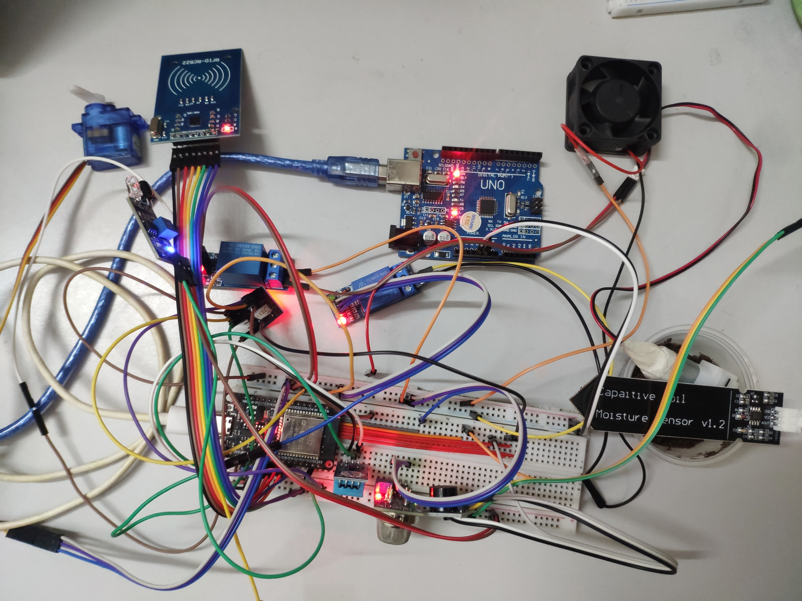
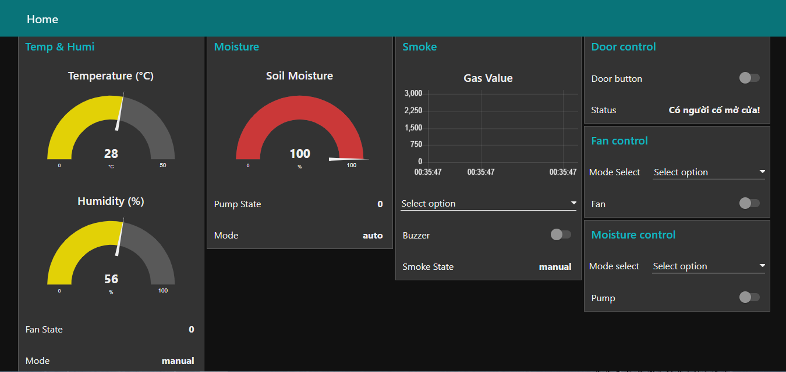

# Smart Home Automation Project

## 1. Đặt vấn đề

Trong thời đại hiện nay, việc xây dựng các hệ thống nhà thông minh trở nên ngày càng phổ biến nhằm nâng cao tiện nghi, an toàn và tiết kiệm năng lượng. Các giải pháp hiện có thường tập trung vào một hoặc vài chức năng riêng lẻ, thiếu tính tích hợp và đồng bộ.  

Dự án này được hình thành với mục tiêu **xây dựng một mô hình nhà thông minh tích hợp nhiều cảm biến và thiết bị**, có khả năng điều khiển từ xa, đồng bộ hóa trạng thái thiết bị, và sử dụng giao thức truyền thông MQTT để giao tiếp giữa các khối chức năng với dashboard trực quan trên Node-RED.  

Nhờ vậy, dự án không chỉ phục vụ mục tiêu học tập và nghiên cứu về IoT, mà còn tạo ra một mô hình minh họa đầy đủ các khối chức năng của một ngôi nhà thông minh thực tế: tự động hóa bảo mật, điều hòa không khí, cảnh báo an toàn và tưới tiêu.

---

## 2. Giới thiệu dự án

Dự án hướng đến xây dựng một mô hình nhà thông minh tự động hóa tích hợp nhiều cảm biến, đồng thời sử dụng giao thức truyền thông MQTT để thực hiện giao tiếp và điều khiển thông qua dashboard của Node-RED.

Dự án bao gồm các chức năng:  
- **Bảo mật bằng cửa tự động**  
- **Làm mát tự động** với quạt và cảm biến nhiệt độ/độ ẩm  
- **Cảnh báo an toàn rò rỉ khí gas**  
- **Hệ thống tưới tiêu tự động**  

Tất cả các khối chức năng đều có thể điều khiển từ xa thông qua dashboard của Node-RED. Dự án được triển khai trên bo mạch **ESP32 Dev-kit V1**, sử dụng **giao thức MQTT** với broker được tạo trên **EMQX**.  

---

### **Chi tiết các khối chức năng**

**1. Làm mát tự động:**  
- Cảm biến: [DHT11](https://linhkienchatluong.vn/urlnhiet-do---do-am/module-cam-bien-nhiet-do-do-am-dht11_sp1670_ct165.aspx)  
- Thiết bị điều khiển: [Relay 1 kênh](https://linhkienchatluong.vn/urlmodule-relay/module-relay-1-kenh-12vdc-tuy-chon-kich-hoat-muc-cao-hoac-thap-hl_sp501_ct6216.aspx), [quạt mini 5V](https://shopee.vn/product/144587162/41563597623?gads_t_sig=VTJGc2RHVmtYMTlxTFVSVVRrdENkUm9yWVZMbGw0Q214S0d1TzNEZmUwNlFiYmdQRE1mSWpFSlB2ZkRROFVWQkMzQjkvWUp0T3JZMDhqSkZMa0JvZEFEUm56L1h1bDFibGFEWEhGUUFBdE0wY2d2b3FTa2hzRFVZczc5cG5ZKy8&gad_source=1&gad_campaignid=22502562452&gbraid=0AAAAADPpQE4MODqTz92dQm5SDn3QmnI9p&gclid=Cj0KCQiA9OnJBhD-ARIsAPV51xNYH4IoAitcQJjoGTaDChI7hK0nFsn9kqf2QE5BIl_l3Czh4R8AhUcaAuEjEALw_wcB)
- Logic hoạt động:  
  - Khi quạt tắt + nhiệt độ ≥ 30°C → quạt bật  
  - Khi quạt bật + nhiệt độ ≤ 25°C → quạt tắt  
- Dashboard:  
  - Thanh chọn chế độ Auto/Manual  
  - Slider điều khiển quạt thủ công  
  - Hiển thị trạng thái quạt và chế độ hệ thống  

**2. Cảnh báo an toàn khí gas:**  
- Cảm biến: [MQ-2](https://linhkienchatluong.vn/urlnuoc---khong-khi---bui/mq2---module-cam-bien-khi-ga-mq2_sp1671_ct154.aspx)
- Thiết bị cảnh báo: [Buzzer](https://linhkienchatluong.vn/urlmodule-audio/active-buzzer-module-ky-012---module-coi-bao_sp505_ct5064.aspx)
- Logic hoạt động:  
  - MQ-2 đo khí ga, buzzer phát khi ngưỡng ≥ 1200  
- Dashboard:  
  - Thanh chọn chế độ Auto/Manual  
  - Slider bật/tắt buzzer thủ công  
  - Hiển thị trạng thái buzzer và chế độ hệ thống  

**3. Bảo mật thông tin với cửa tự động:**  
- Thiết bị: [Module RFID](https://linhkienchatluong.vn/urlmodule-rfrfid/module-rfid-rc522-nfc-1356mhz_sp491_ct192.aspx), [servo 180°/360°](https://linhkienchatluong.vn/urldong-co-buoc---servo/dong-co-servo-sg90-rc-360-do_sp1117_ct16869.aspx)
, [cảm biến tiệm cận hồng ngoại](https://shopee.vn/product/325406709/7560442088?gads_t_sig=VTJGc2RHVmtYMTlxTFVSVVRrdENkUzJYdkg4SUFId3huV3BOemxRSlQvQTlNVHlraE44UDJ5VzBjZ3NYbjFXK1E1eDR5Z1lZR1JxQVUyLytLOElIbG1iWVM5QTM1V3JRNm43OEEyZ1pKaWNwRWZoWndIL3RyTW56Mm9MUVY2ZlM&gad_source=1&gad_campaignid=22496085537&gbraid=0AAAAADPpQE6noBxh6IoNt68Ks_AqRpo9Y&gclid=Cj0KCQiA9OnJBhD-ARIsAPV51xNA3kSX2EhkIOAgyrSIIGV5uxbJmXN9tRZIgwUF1f3ibOqu4yxpvrcaAphVEALw_wcB)
- Logic hoạt động:  
  - Thẻ hợp lệ → mở servo  
  - Cảm biến tiệm cận:  
    - Không có người → đợi 5 giây rồi đóng cửa  
    - Có người đi qua → giữ cửa mở, sau 3 giây không có người → đóng cửa  
  - Dashboard hiển thị:  
    - `"Chủ đã về"` khi quẹt thẻ hợp lệ  
    - `"Có người đang cố mở cửa"` khi quẹt thẻ không hợp lệ  
    - Slider điều khiển đóng/mở cửa thủ công  

**4. Hệ thống tưới tiêu tự động:**  
- Cảm biến: [Moisture sensor](https://linhkienchatluong.vn/urlnhiet-do---do-am/module-cam-bien-do-am-dat-soil-moisture-sensor-v12_sp1670_ct15982.aspx)  
- Thiết bị điều khiển: [Máy bơm mini 5V]((https://shopee.vn/-L%E1%BA%ADp-Tr%C3%ACnh-Nh%C3%BAng-A-Z-G84-M%C3%A1y-B%C6%A1m-N%C6%B0%E1%BB%9Bc-Nh%E1%BB%8F-030-5V-80mA-i.107147748.26190698901?extraParams=%7B%22display_model_id%22%3A188672613763%2C%22model_selection_logic%22%3A3%7D&sp_atk=be2b94cf-1053-47c6-b9d2-8b253f76127d&xptdk=be2b94cf-1053-47c6-b9d2-8b253f76127d)), relay 1 kênh  
- Logic hoạt động:  
  - Độ ẩm đất ≤ 30% → máy bơm bật  
  - Độ ẩm đất ≥ 60% → máy bơm tắt  
- Dashboard:  
  - Slider điều khiển máy bơm thủ công  
  - Thanh chọn chế độ Auto/Manual  
  - Hiển thị trạng thái máy bơm và chế độ hệ thống

## 3. Mô hình ngoài đời

  
> Hình ảnh minh họa mô hình nhà thông minh với các linh kiện được lắp đặt trên bảng thử nghiệm.

---

## 4. Giao diện Dashboard

  
> Giao diện Node-RED hiển thị các khối chức năng, trạng thái thiết bị và công tắc điều khiển.

---

## 5. Lưu ý kỹ thuật

- Do số lượng linh kiện khá nhiều, ESP32 có thể không đủ nguồn cấp, nên một **Arduino Uno** được sử dụng như bộ nguồn phụ để cấp điện cho các linh kiện.  
- Hệ thống cơ bản đã hoạt động ổn định, nhưng còn tồn tại một số vấn đề về logic khi thay đổi chế độ Auto/Manual trên dashboard:  
  - Khi ở chế độ Auto, nhấn slider điều khiển thiết bị (quạt, máy bơm) sẽ tự động đẩy trạng thái sang Manual, nhưng thanh chọn chế độ vẫn về mặc định (Select option), có khả năng gây nhầm lẫn logic hệ thống.  

---

## 6. Cấu trúc folder dự án

│
├─ data/
│   └─ emqx_ca.crt
│
├─ images/
│   ├─ system.png
│   └─ dashboard.png
│
├─ include/
│   ├─ cert.h
│   ├─ Temp.h
│   ├─ Smoke.h
│   ├─ RFID.h
│   ├─ Moisture.h
│   └─ MqttManager.h
│
├─ Library/
│   └─ Necessary_library.txt
│
├─ node-red_flow/
│   ├─ Smoke.txt
│   ├─ Temp.txt
│   ├─ RFID.txt
│   └─ Moisture.txt
│
├─ src/
│   ├─ cert.cpp
│   ├─ Temp.cpp
│   ├─ Smoke.cpp
│   ├─ RFID.cpp
│   ├─ Moisture.cpp
│   ├─ MqttManager.cpp
│   └─ main.cpp
│
├─ .gitignore
├─ platformio.ini
└─ README.md

---

## 7. Hướng dẫn chạy dự án

1. Fork dự án hoặc clone về máy chủ.  
2. Mở project trong **PlatformIO trên VS Code**.  
3. Cài các thư viện cần thiết (xem trong folder `Library`).  
4. Import flow các khối chức năng (trong folder node-red_flow) vào Node-RED.  
5. Kết nối ESP32 với các linh kiện tương ứng để chạy hệ thống.  

---

## 8. Lời kết

Đây là một dự án nhỏ phục vụ nghiên cứu và học tập.  
Mọi ý kiến góp ý và đề xuất cải tiến đều được hoan nghênh và tiếp thu. Mỗi nhận xét đều là cơ sở để phát triển các dự án tiếp theo.

---

## 9. Tác giả

**Mai Đình Đức Trung**
